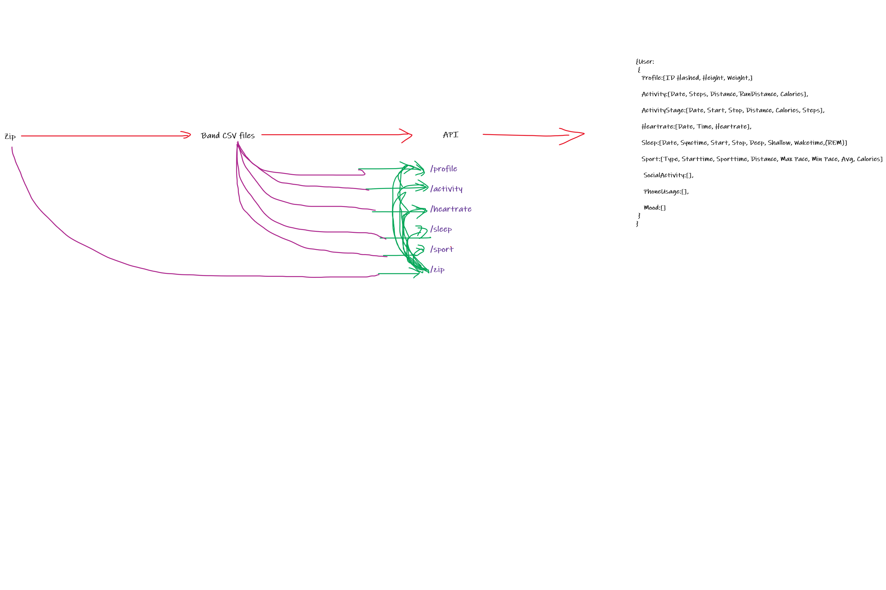

# filestore

RELEVANT RESEARCH PAPERS LIST AND LINKS

[Conference Alerts 2019-2020 | Academic Conferences 2019-2020 - AllConferenceAlert](https://www.allconferencealert.com/searchresult.html)

[Search results for: depression (waset.org)](https://waset.org/search?q=depression)

https://publication-recommender.ieee.org/pubsearch

Paper formatting as per AJP - https://ajp.psychiatryonline.org/ajp_ifora

METHODOLOGIES IN CLINICAL TRIALS:

- Lifestyle medicine for depression 2019 - they track change in PHQ-9 scores and other scales including DASS-21, ISI (Insomnia Severity Index), SF-6D , HPLP II, SDS, CEQ https://www.clinicaltrials.gov/ct2/show/record/NCT04070417?cond=depression&draw=2&rank=3
- Training and Supervision program - they track change in PHQ-9 in 3 months, 6 months. Adherence to depression treatment, change of baseline quality of life and clinical outcomes at 3 & 6 months, use of health services [Training and Supervision Program for Depression Management - Full Text View - ClinicalTrials.gov](https://www.clinicaltrials.gov/ct2/show/NCT02232854?cond=depression&draw=2&rank=10)

